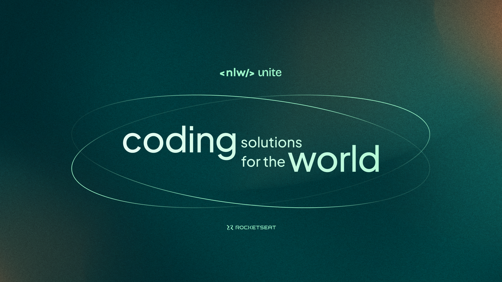

# CheckAqui

O CheckAqui é uma aplicação de **gestão de participantes em eventos presenciais**.

A ferramenta permite que o organizador cadastre um evento e abra uma página pública de inscrição.

Os participantes inscritos podem emitir uma credencial para check-in no dia do evento.

O sistema fará um scan da credencial do participante para permitir a entrada no evento.

## Requisitos

### Requisitos funcionais

- [x] O organizador deve poder cadastrar um novo evento;
- [x] O organizador deve poder visualizar dados de um evento;
- [x] O organizador deve poser visualizar a lista de participantes;
- [x] O participante deve poder se inscrever em um evento;
- [x] O participante deve poder visualizar seu crachá de inscrição;
- [x] O participante deve poder realizar check-in no evento;

### Regras de negócio

- [x] O participante só pode se inscrever em um evento uma única vez;
- [x] O participante só pode se inscrever em eventos com vagas disponíveis;
- [x] O participante só pode realizar check-in em um evento uma única vez;

### Requisitos não-funcionais

- [x] O check-in no evento será realizado através de um QRCode;

## Documentação da API (Swagger)

Para documentação da API, acesse o link: https://nlw-unite-nodejs.onrender.com/docs

## Banco de dados

Nessa aplicação vamos utilizar banco de dados relacional (SQL). Para ambiente de desenvolvimento seguiremos com o SQLite pela facilidade do ambiente.

### Diagrama ERD


### Estrutura do banco (SQL)

```sql
-- CreateTable
CREATE TABLE "events" (
    "id" TEXT NOT NULL PRIMARY KEY,
    "title" TEXT NOT NULL,
    "details" TEXT,
    "slug" TEXT NOT NULL,
    "maximum_attendees" INTEGER
);

-- CreateTable
CREATE TABLE "attendees" (
    "id" TEXT NOT NULL PRIMARY KEY,
    "name" TEXT NOT NULL,
    "email" TEXT NOT NULL,
    "event_id" TEXT NOT NULL,
    "created_at" DATETIME NOT NULL DEFAULT CURRENT_TIMESTAMP,
    CONSTRAINT "attendees_event_id_fkey" FOREIGN KEY ("event_id") REFERENCES "events" ("id") ON DELETE RESTRICT ON UPDATE CASCADE
);

-- CreateTable
CREATE TABLE "check_ins" (
    "id" INTEGER NOT NULL PRIMARY KEY AUTOINCREMENT,
    "created_at" DATETIME NOT NULL DEFAULT CURRENT_TIMESTAMP,
    "attendeeId" INTEGER NOT NULL,
    CONSTRAINT "check_ins_attendeeId_fkey" FOREIGN KEY ("attendeeId") REFERENCES "attendees" ("id") ON DELETE RESTRICT ON UPDATE CASCADE
);

-- CreateIndex
CREATE UNIQUE INDEX "events_slug_key" ON "events"("slug");

-- CreateIndex
CREATE UNIQUE INDEX "attendees_event_id_email_key" ON "attendees"("event_id", "email");

-- CreateIndex
CREATE UNIQUE INDEX "check_ins_attendeeId_key" ON "check_ins"("attendeeId");
```

## Clonando e Rodando a Aplicação CheckAqui

### Pré-requisitos

Certifique-se de ter o Node.js e o npm (Node Package Manager) instalados em sua máquina.

### Crie e configure as variáveis de ambiente no arquivo .env na raiz do projeto

### Passo 1: Clonando o repositório

1. Abra o terminal ou prompt de comando.
2. Navegue até o diretório onde deseja clonar o repositório.
3. Execute o seguinte comando para clonar o repositório:
   <pre><div class="dark bg-gray-950 rounded-md"><div class="flex items-center relative text-token-text-secondary bg-token-main-surface-secondary px-4 py-2 text-xs font-sans justify-between rounded-t-md"><span>bash</span><span class="" data-state="closed"><button class="flex gap-1 items-center"><svg width="24" height="24" viewBox="0 0 24 24" fill="none" xmlns="http://www.w3.org/2000/svg" class="icon-sm"><path fill-rule="evenodd" clip-rule="evenodd" d="M12 3.5C10.8954 3.5 10 4.39543 10 5.5H14C14 4.39543 13.1046 3.5 12 3.5ZM8.53513 3.5C9.22675 2.3044 10.5194 1.5 12 1.5C13.4806 1.5 14.7733 2.3044 15.4649 3.5H17.25C18.9069 3.5 20.25 4.84315 20.25 6.5V18.5C20.25 20.1569 19.1569 21.5 17.25 21.5H6.75C5.09315 21.5 3.75 20.1569 3.75 18.5V6.5C3.75 4.84315 5.09315 3.5 6.75 3.5H8.53513ZM8 5.5H6.75C6.19772 5.5 5.75 5.94772 5.75 6.5V18.5C5.75 19.0523 6.19772 19.5 6.75 19.5H17.25C18.0523 19.5 18.25 19.0523 18.25 18.5V6.5C18.25 5.94772 17.8023 5.5 17.25 5.5H16C16 6.60457 15.1046 7.5 14 7.5H10C8.89543 7.5 8 6.60457 8 5.5Z" fill="currentColor"></path></svg>Copy code</button></span></div><div class="p-4 overflow-y-auto"><code class="!whitespace-pre hljs language-bash">git clone https://github.com/seu-usuario/checkaqui.git
   </code></div></div></pre>

### Passo 2: Configuração do Backend

1. Abra o terminal ou prompt de comando.
2. Navegue até o diretório do projeto clonado (`checkaqui/backend`).
3. Execute o comando para instalar as dependências do backend:
   <pre><div class="dark bg-gray-950 rounded-md"><div class="flex items-center relative text-token-text-secondary bg-token-main-surface-secondary px-4 py-2 text-xs font-sans justify-between rounded-t-md"><span>bash</span><span class="" data-state="closed"><button class="flex gap-1 items-center"><svg width="24" height="24" viewBox="0 0 24 24" fill="none" xmlns="http://www.w3.org/2000/svg" class="icon-sm"><path fill-rule="evenodd" clip-rule="evenodd" d="M12 3.5C10.8954 3.5 10 4.39543 10 5.5H14C14 4.39543 13.1046 3.5 12 3.5ZM8.53513 3.5C9.22675 2.3044 10.5194 1.5 12 1.5C13.4806 1.5 14.7733 2.3044 15.4649 3.5H17.25C18.9069 3.5 20.25 4.84315 20.25 6.5V18.5C20.25 20.1569 19.1569 21.5 17.25 21.5H6.75C5.09315 21.5 3.75 20.1569 3.75 18.5V6.5C3.75 4.84315 5.09315 3.5 6.75 3.5H8.53513ZM8 5.5H6.75C6.19772 5.5 5.75 5.94772 5.75 6.5V18.5C5.75 19.0523 6.19772 19.5 6.75 19.5H17.25C18.0523 19.5 18.25 19.0523 18.25 18.5V6.5C18.25 5.94772 17.8023 5.5 17.25 5.5H16C16 6.60457 15.1046 7.5 14 7.5H10C8.89543 7.5 8 6.60457 8 5.5Z" fill="currentColor"></path></svg>Copy code</button></span></div><div class="p-4 overflow-y-auto"><code class="!whitespace-pre hljs language-bash">npm install
   </code></div></div></pre>
4. No diretório `checkaqui/backend`, crie um arquivo chamado `.env` e adicione as seguintes variáveis de ambiente:
   <pre><div class="dark bg-gray-950 rounded-md"><div class="flex items-center relative text-token-text-secondary bg-token-main-surface-secondary px-4 py-2 text-xs font-sans justify-between rounded-t-md"><span>makefile</span><span class="" data-state="closed"><button class="flex gap-1 items-center"><svg width="24" height="24" viewBox="0 0 24 24" fill="none" xmlns="http://www.w3.org/2000/svg" class="icon-sm"><path fill-rule="evenodd" clip-rule="evenodd" d="M12 3.5C10.8954 3.5 10 4.39543 10 5.5H14C14 4.39543 13.1046 3.5 12 3.5ZM8.53513 3.5C9.22675 2.3044 10.5194 1.5 12 1.5C13.4806 1.5 14.7733 2.3044 15.4649 3.5H17.25C18.9069 3.5 20.25 4.84315 20.25 6.5V18.5C20.25 20.1569 19.1569 21.5 17.25 21.5H6.75C5.09315 21.5 3.75 20.1569 3.75 18.5V6.5C3.75 4.84315 5.09315 3.5 6.75 3.5H8.53513ZM8 5.5H6.75C6.19772 5.5 5.75 5.94772 5.75 6.5V18.5C5.75 19.0523 6.19772 19.5 6.75 19.5H17.25C18.0523 19.5 18.25 19.0523 18.25 18.5V6.5C18.25 5.94772 17.8023 5.5 17.25 5.5H16C16 6.60457 15.1046 7.5 14 7.5H10C8.89543 7.5 8 6.60457 8 5.5Z" fill="currentColor"></path></svg>Copy code</button></span></div><div class="p-4 overflow-y-auto"><code class="!whitespace-pre hljs language-makefile">DATABASE_URL="sqlite:./dev.db"
   </code></div></div></pre>
5. No terminal, execute o comando para criar as tabelas e popular o banco de dados:
   <pre><div class="dark bg-gray-950 rounded-md"><div class="flex items-center relative text-token-text-secondary bg-token-main-surface-secondary px-4 py-2 text-xs font-sans justify-between rounded-t-md"><span>bash</span><span class="" data-state="closed"><button class="flex gap-1 items-center"><svg width="24" height="24" viewBox="0 0 24 24" fill="none" xmlns="http://www.w3.org/2000/svg" class="icon-sm"><path fill-rule="evenodd" clip-rule="evenodd" d="M12 3.5C10.8954 3.5 10 4.39543 10 5.5H14C14 4.39543 13.1046 3.5 12 3.5ZM8.53513 3.5C9.22675 2.3044 10.5194 1.5 12 1.5C13.4806 1.5 14.7733 2.3044 15.4649 3.5H17.25C18.9069 3.5 20.25 4.84315 20.25 6.5V18.5C20.25 20.1569 19.1569 21.5 17.25 21.5H6.75C5.09315 21.5 3.75 20.1569 3.75 18.5V6.5C3.75 4.84315 5.09315 3.5 6.75 3.5H8.53513ZM8 5.5H6.75C6.19772 5.5 5.75 5.94772 5.75 6.5V18.5C5.75 19.0523 6.19772 19.5 6.75 19.5H17.25C18.0523 19.5 18.25 19.0523 18.25 18.5V6.5C18.25 5.94772 17.8023 5.5 17.25 5.5H16C16 6.60457 15.1046 7.5 14 7.5H10C8.89543 7.5 8 6.60457 8 5.5Z" fill="currentColor"></path></svg>Copy code</button></span></div><div class="p-4 overflow-y-auto"><code class="!whitespace-pre hljs language-bash">npx prisma migrate dev --name init --preview-feature
   </code></div></div></pre>
6. Execute o seguinte comando para iniciar o servidor do backend:
   <pre><div class="dark bg-gray-950 rounded-md"><div class="flex items-center relative text-token-text-secondary bg-token-main-surface-secondary px-4 py-2 text-xs font-sans justify-between rounded-t-md"><span>bash</span><span class="" data-state="closed"><button class="flex gap-1 items-center"><svg width="24" height="24" viewBox="0 0 24 24" fill="none" xmlns="http://www.w3.org/2000/svg" class="icon-sm"><path fill-rule="evenodd" clip-rule="evenodd" d="M12 3.5C10.8954 3.5 10 4.39543 10 5.5H14C14 4.39543 13.1046 3.5 12 3.5ZM8.53513 3.5C9.22675 2.3044 10.5194 1.5 12 1.5C13.4806 1.5 14.7733 2.3044 15.4649 3.5H17.25C18.9069 3.5 20.25 4.84315 20.25 6.5V18.5C20.25 20.1569 19.1569 21.5 17.25 21.5H6.75C5.09315 21.5 3.75 20.1569 3.75 18.5V6.5C3.75 4.84315 5.09315 3.5 6.75 3.5H8.53513ZM8 5.5H6.75C6.19772 5.5 5.75 5.94772 5.75 6.5V18.5C5.75 19.0523 6.19772 19.5 6.75 19.5H17.25C18.0523 19.5 18.25 19.0523 18.25 18.5V6.5C18.25 5.94772 17.8023 5.5 17.25 5.5H16C16 6.60457 15.1046 7.5 14 7.5H10C8.89543 7.5 8 6.60457 8 5.5Z" fill="currentColor"></path></svg>Copy code</button></span></div><div class="p-4 overflow-y-auto"><code class="!whitespace-pre hljs language-bash">npm run dev
   </code></div></div></pre>

### Passo 3: Configuração do Frontend

1. Abra outro terminal ou prompt de comando.
2. Navegue até o diretório do frontend (`checkaqui/frontend`).
3. Execute o comando para instalar as dependências do frontend:
   <pre><div class="dark bg-gray-950 rounded-md"><div class="flex items-center relative text-token-text-secondary bg-token-main-surface-secondary px-4 py-2 text-xs font-sans justify-between rounded-t-md"><span>bash</span><span class="" data-state="closed"><button class="flex gap-1 items-center"><svg width="24" height="24" viewBox="0 0 24 24" fill="none" xmlns="http://www.w3.org/2000/svg" class="icon-sm"><path fill-rule="evenodd" clip-rule="evenodd" d="M12 3.5C10.8954 3.5 10 4.39543 10 5.5H14C14 4.39543 13.1046 3.5 12 3.5ZM8.53513 3.5C9.22675 2.3044 10.5194 1.5 12 1.5C13.4806 1.5 14.7733 2.3044 15.4649 3.5H17.25C18.9069 3.5 20.25 4.84315 20.25 6.5V18.5C20.25 20.1569 19.1569 21.5 17.25 21.5H6.75C5.09315 21.5 3.75 20.1569 3.75 18.5V6.5C3.75 4.84315 5.09315 3.5 6.75 3.5H8.53513ZM8 5.5H6.75C6.19772 5.5 5.75 5.94772 5.75 6.5V18.5C5.75 19.0523 6.19772 19.5 6.75 19.5H17.25C18.0523 19.5 18.25 19.0523 18.25 18.5V6.5C18.25 5.94772 17.8023 5.5 17.25 5.5H16C16 6.60457 15.1046 7.5 14 7.5H10C8.89543 7.5 8 6.60457 8 5.5Z" fill="currentColor"></path></svg>Copy code</button></span></div><div class="p-4 overflow-y-auto"><code class="!whitespace-pre hljs language-bash">npm install
   </code></div></div></pre>
4. Execute o seguinte comando para iniciar o servidor de desenvolvimento do frontend:
   <pre><div class="dark bg-gray-950 rounded-md"><div class="flex items-center relative text-token-text-secondary bg-token-main-surface-secondary px-4 py-2 text-xs font-sans justify-between rounded-t-md"><span>bash</span><span class="" data-state="closed"><button class="flex gap-1 items-center"><svg width="24" height="24" viewBox="0 0 24 24" fill="none" xmlns="http://www.w3.org/2000/svg" class="icon-sm"><path fill-rule="evenodd" clip-rule="evenodd" d="M12 3.5C10.8954 3.5 10 4.39543 10 5.5H14C14 4.39543 13.1046 3.5 12 3.5ZM8.53513 3.5C9.22675 2.3044 10.5194 1.5 12 1.5C13.4806 1.5 14.7733 2.3044 15.4649 3.5H17.25C18.9069 3.5 20.25 4.84315 20.25 6.5V18.5C20.25 20.1569 19.1569 21.5 17.25 21.5H6.75C5.09315 21.5 3.75 20.1569 3.75 18.5V6.5C3.75 4.84315 5.09315 3.5 6.75 3.5H8.53513ZM8 5.5H6.75C6.19772 5.5 5.75 5.94772 5.75 6.5V18.5C5.75 19.0523 6.19772 19.5 6.75 19.5H17.25C18.0523 19.5 18.25 19.0523 18.25 18.5V6.5C18.25 5.94772 17.8023 5.5 17.25 5.5H16C16 6.60457 15.1046 7.5 14 7.5H10C8.89543 7.5 8 6.60457 8 5.5Z" fill="currentColor"></path></svg>Copy code</button></span></div><div class="p-4 overflow-y-auto"><code class="!whitespace-pre hljs language-bash">npm start
   </code></div></div></pre>
5. Após o servidor iniciar com sucesso, abra o navegador e acesse `http://localhost:3000` para usar a aplicação CheckAqui.

### Passo 4: Documentação da API (Swagger)

1. Para acessar a documentação da API, abra o navegador e acesse o link:
   <pre><div class="dark bg-gray-950 rounded-md"><div class="flex items-center relative text-token-text-secondary bg-token-main-surface-secondary px-4 py-2 text-xs font-sans justify-between rounded-t-md"><span>bash</span><span class="" data-state="closed"><button class="flex gap-1 items-center"><svg width="24" height="24" viewBox="0 0 24 24" fill="none" xmlns="http://www.w3.org/2000/svg" class="icon-sm"><path fill-rule="evenodd" clip-rule="evenodd" d="M12 3.5C10.8954 3.5 10 4.39543 10 5.5H14C14 4.39543 13.1046 3.5 12 3.5ZM8.53513 3.5C9.22675 2.3044 10.5194 1.5 12 1.5C13.4806 1.5 14.7733 2.3044 15.4649 3.5H17.25C18.9069 3.5 20.25 4.84315 20.25 6.5V18.5C20.25 20.1569 19.1569 21.5 17.25 21.5H6.75C5.09315 21.5 3.75 20.1569 3.75 18.5V6.5C3.75 4.84315 5.09315 3.5 6.75 3.5H8.53513ZM8 5.5H6.75C6.19772 5.5 5.75 5.94772 5.75 6.5V18.5C5.75 19.0523 6.19772 19.5 6.75 19.5H17.25C18.0523 19.5 18.25 19.0523 18.25 18.5V6.5C18.25 5.94772 17.8023 5.5 17.25 5.5H16C16 6.60457 15.1046 7.5 14 7.5H10C8.89543 7.5 8 6.60457 8 5.5Z" fill="currentColor"></path></svg>Copy code</button></span></div><div class="p-4 overflow-y-auto"><code class="!whitespace-pre hljs language-bash">http://localhost:3000/docs</code></div></div></pre>

## Clonando e Rodando a Aplicação CheckAqui

### Pré-requisitos

Certifique-se de ter o Node.js e o npm (Node Package Manager) instalados em sua máquina.

### Passo 1: Clonando o repositório

1. Abra o terminal ou prompt de comando.
2. Navegue até o diretório onde deseja clonar o repositório.
3. Execute o seguinte comando para clonar o repositório:
   <pre><div class="dark bg-gray-950 rounded-md"><div class="flex items-center relative text-token-text-secondary bg-token-main-surface-secondary px-4 py-2 text-xs font-sans justify-between rounded-t-md"><span>bash</span><span class="" data-state="closed"><button class="flex gap-1 items-center"><svg width="24" height="24" viewBox="0 0 24 24" fill="none" xmlns="http://www.w3.org/2000/svg" class="icon-sm"><path fill-rule="evenodd" clip-rule="evenodd" d="M12 3.5C10.8954 3.5 10 4.39543 10 5.5H14C14 4.39543 13.1046 3.5 12 3.5ZM8.53513 3.5C9.22675 2.3044 10.5194 1.5 12 1.5C13.4806 1.5 14.7733 2.3044 15.4649 3.5H17.25C18.9069 3.5 20.25 4.84315 20.25 6.5V18.5C20.25 20.1569 19.1569 21.5 17.25 21.5H6.75C5.09315 21.5 3.75 20.1569 3.75 18.5V6.5C3.75 4.84315 5.09315 3.5 6.75 3.5H8.53513ZM8 5.5H6.75C6.19772 5.5 5.75 5.94772 5.75 6.5V18.5C5.75 19.0523 6.19772 19.5 6.75 19.5H17.25C18.0523 19.5 18.25 19.0523 18.25 18.5V6.5C18.25 5.94772 17.8023 5.5 17.25 5.5H16C16 6.60457 15.1046 7.5 14 7.5H10C8.89543 7.5 8 6.60457 8 5.5Z" fill="currentColor"></path></svg>Copy code</button></span></div><div class="p-4 overflow-y-auto"><code class="!whitespace-pre hljs language-bash">git clone https://github.com/seu-usuario/checkaqui.git
   </code></div></div></pre>

### Passo 2: Configuração do Backend

1. Abra o terminal ou prompt de comando.
2. Navegue até o diretório do projeto clonado (`checkaqui/backend`).
3. Execute o comando para instalar as dependências do backend:
   <pre><div class="dark bg-gray-950 rounded-md"><div class="flex items-center relative text-token-text-secondary bg-token-main-surface-secondary px-4 py-2 text-xs font-sans justify-between rounded-t-md"><span>bash</span><span class="" data-state="closed"><button class="flex gap-1 items-center"><svg width="24" height="24" viewBox="0 0 24 24" fill="none" xmlns="http://www.w3.org/2000/svg" class="icon-sm"><path fill-rule="evenodd" clip-rule="evenodd" d="M12 3.5C10.8954 3.5 10 4.39543 10 5.5H14C14 4.39543 13.1046 3.5 12 3.5ZM8.53513 3.5C9.22675 2.3044 10.5194 1.5 12 1.5C13.4806 1.5 14.7733 2.3044 15.4649 3.5H17.25C18.9069 3.5 20.25 4.84315 20.25 6.5V18.5C20.25 20.1569 19.1569 21.5 17.25 21.5H6.75C5.09315 21.5 3.75 20.1569 3.75 18.5V6.5C3.75 4.84315 5.09315 3.5 6.75 3.5H8.53513ZM8 5.5H6.75C6.19772 5.5 5.75 5.94772 5.75 6.5V18.5C5.75 19.0523 6.19772 19.5 6.75 19.5H17.25C18.0523 19.5 18.25 19.0523 18.25 18.5V6.5C18.25 5.94772 17.8023 5.5 17.25 5.5H16C16 6.60457 15.1046 7.5 14 7.5H10C8.89543 7.5 8 6.60457 8 5.5Z" fill="currentColor"></path></svg>Copy code</button></span></div><div class="p-4 overflow-y-auto"><code class="!whitespace-pre hljs language-bash">npm install
   </code></div></div></pre>
4. No diretório `checkaqui/backend`, crie um arquivo chamado `.env` e adicione as seguintes variáveis de ambiente:
   <pre><div class="dark bg-gray-950 rounded-md"><div class="flex items-center relative text-token-text-secondary bg-token-main-surface-secondary px-4 py-2 text-xs font-sans justify-between rounded-t-md"><span>makefile</span><span class="" data-state="closed"><button class="flex gap-1 items-center"><svg width="24" height="24" viewBox="0 0 24 24" fill="none" xmlns="http://www.w3.org/2000/svg" class="icon-sm"><path fill-rule="evenodd" clip-rule="evenodd" d="M12 3.5C10.8954 3.5 10 4.39543 10 5.5H14C14 4.39543 13.1046 3.5 12 3.5ZM8.53513 3.5C9.22675 2.3044 10.5194 1.5 12 1.5C13.4806 1.5 14.7733 2.3044 15.4649 3.5H17.25C18.9069 3.5 20.25 4.84315 20.25 6.5V18.5C20.25 20.1569 19.1569 21.5 17.25 21.5H6.75C5.09315 21.5 3.75 20.1569 3.75 18.5V6.5C3.75 4.84315 5.09315 3.5 6.75 3.5H8.53513ZM8 5.5H6.75C6.19772 5.5 5.75 5.94772 5.75 6.5V18.5C5.75 19.0523 6.19772 19.5 6.75 19.5H17.25C18.0523 19.5 18.25 19.0523 18.25 18.5V6.5C18.25 5.94772 17.8023 5.5 17.25 5.5H16C16 6.60457 15.1046 7.5 14 7.5H10C8.89543 7.5 8 6.60457 8 5.5Z" fill="currentColor"></path></svg>Copy code</button></span></div><div class="p-4 overflow-y-auto"><code class="!whitespace-pre hljs language-makefile">DATABASE_URL="sqlite:./dev.db"
   </code></div></div></pre>
5. No terminal, execute o comando para criar as tabelas e popular o banco de dados:
   <pre><div class="dark bg-gray-950 rounded-md"><div class="flex items-center relative text-token-text-secondary bg-token-main-surface-secondary px-4 py-2 text-xs font-sans justify-between rounded-t-md"><span>bash</span><span class="" data-state="closed"><button class="flex gap-1 items-center"><svg width="24" height="24" viewBox="0 0 24 24" fill="none" xmlns="http://www.w3.org/2000/svg" class="icon-sm"><path fill-rule="evenodd" clip-rule="evenodd" d="M12 3.5C10.8954 3.5 10 4.39543 10 5.5H14C14 4.39543 13.1046 3.5 12 3.5ZM8.53513 3.5C9.22675 2.3044 10.5194 1.5 12 1.5C13.4806 1.5 14.7733 2.3044 15.4649 3.5H17.25C18.9069 3.5 20.25 4.84315 20.25 6.5V18.5C20.25 20.1569 19.1569 21.5 17.25 21.5H6.75C5.09315 21.5 3.75 20.1569 3.75 18.5V6.5C3.75 4.84315 5.09315 3.5 6.75 3.5H8.53513ZM8 5.5H6.75C6.19772 5.5 5.75 5.94772 5.75 6.5V18.5C5.75 19.0523 6.19772 19.5 6.75 19.5H17.25C18.0523 19.5 18.25 19.0523 18.25 18.5V6.5C18.25 5.94772 17.8023 5.5 17.25 5.5H16C16 6.60457 15.1046 7.5 14 7.5H10C8.89543 7.5 8 6.60457 8 5.5Z" fill="currentColor"></path></svg>Copy code</button></span></div><div class="p-4 overflow-y-auto"><code class="!whitespace-pre hljs language-bash">npx prisma migrate dev --name init --preview-feature
   </code></div></div></pre>
6. Execute o seguinte comando para iniciar o servidor do backend:
   <pre><div class="dark bg-gray-950 rounded-md"><div class="flex items-center relative text-token-text-secondary bg-token-main-surface-secondary px-4 py-2 text-xs font-sans justify-between rounded-t-md"><span>bash</span><span class="" data-state="closed"><button class="flex gap-1 items-center"><svg width="24" height="24" viewBox="0 0 24 24" fill="none" xmlns="http://www.w3.org/2000/svg" class="icon-sm"><path fill-rule="evenodd" clip-rule="evenodd" d="M12 3.5C10.8954 3.5 10 4.39543 10 5.5H14C14 4.39543 13.1046 3.5 12 3.5ZM8.53513 3.5C9.22675 2.3044 10.5194 1.5 12 1.5C13.4806 1.5 14.7733 2.3044 15.4649 3.5H17.25C18.9069 3.5 20.25 4.84315 20.25 6.5V18.5C20.25 20.1569 19.1569 21.5 17.25 21.5H6.75C5.09315 21.5 3.75 20.1569 3.75 18.5V6.5C3.75 4.84315 5.09315 3.5 6.75 3.5H8.53513ZM8 5.5H6.75C6.19772 5.5 5.75 5.94772 5.75 6.5V18.5C5.75 19.0523 6.19772 19.5 6.75 19.5H17.25C18.0523 19.5 18.25 19.0523 18.25 18.5V6.5C18.25 5.94772 17.8023 5.5 17.25 5.5H16C16 6.60457 15.1046 7.5 14 7.5H10C8.89543 7.5 8 6.60457 8 5.5Z" fill="currentColor"></path></svg>Copy code</button></span></div><div class="p-4 overflow-y-auto"><code class="!whitespace-pre hljs language-bash">npm run dev
   </code></div></div></pre>

### Passo 3: Configuração do Frontend

1. Abra outro terminal ou prompt de comando.
2. Navegue até o diretório do frontend (`checkaqui/frontend`).
3. Execute o comando para instalar as dependências do frontend:
   <pre><div class="dark bg-gray-950 rounded-md"><div class="flex items-center relative text-token-text-secondary bg-token-main-surface-secondary px-4 py-2 text-xs font-sans justify-between rounded-t-md"><span>bash</span><span class="" data-state="closed"><button class="flex gap-1 items-center"><svg width="24" height="24" viewBox="0 0 24 24" fill="none" xmlns="http://www.w3.org/2000/svg" class="icon-sm"><path fill-rule="evenodd" clip-rule="evenodd" d="M12 3.5C10.8954 3.5 10 4.39543 10 5.5H14C14 4.39543 13.1046 3.5 12 3.5ZM8.53513 3.5C9.22675 2.3044 10.5194 1.5 12 1.5C13.4806 1.5 14.7733 2.3044 15.4649 3.5H17.25C18.9069 3.5 20.25 4.84315 20.25 6.5V18.5C20.25 20.1569 19.1569 21.5 17.25 21.5H6.75C5.09315 21.5 3.75 20.1569 3.75 18.5V6.5C3.75 4.84315 5.09315 3.5 6.75 3.5H8.53513ZM8 5.5H6.75C6.19772 5.5 5.75 5.94772 5.75 6.5V18.5C5.75 19.0523 6.19772 19.5 6.75 19.5H17.25C18.0523 19.5 18.25 19.0523 18.25 18.5V6.5C18.25 5.94772 17.8023 5.5 17.25 5.5H16C16 6.60457 15.1046 7.5 14 7.5H10C8.89543 7.5 8 6.60457 8 5.5Z" fill="currentColor"></path></svg>Copy code</button></span></div><div class="p-4 overflow-y-auto"><code class="!whitespace-pre hljs language-bash">npm install
   </code></div></div></pre>
4. Execute o seguinte comando para iniciar o servidor de desenvolvimento do frontend:
   <pre><div class="dark bg-gray-950 rounded-md"><div class="flex items-center relative text-token-text-secondary bg-token-main-surface-secondary px-4 py-2 text-xs font-sans justify-between rounded-t-md"><span>bash</span><span class="" data-state="closed"><button class="flex gap-1 items-center"><svg width="24" height="24" viewBox="0 0 24 24" fill="none" xmlns="http://www.w3.org/2000/svg" class="icon-sm"><path fill-rule="evenodd" clip-rule="evenodd" d="M12 3.5C10.8954 3.5 10 4.39543 10 5.5H14C14 4.39543 13.1046 3.5 12 3.5ZM8.53513 3.5C9.22675 2.3044 10.5194 1.5 12 1.5C13.4806 1.5 14.7733 2.3044 15.4649 3.5H17.25C18.9069 3.5 20.25 4.84315 20.25 6.5V18.5C20.25 20.1569 19.1569 21.5 17.25 21.5H6.75C5.09315 21.5 3.75 20.1569 3.75 18.5V6.5C3.75 4.84315 5.09315 3.5 6.75 3.5H8.53513ZM8 5.5H6.75C6.19772 5.5 5.75 5.94772 5.75 6.5V18.5C5.75 19.0523 6.19772 19.5 6.75 19.5H17.25C18.0523 19.5 18.25 19.0523 18.25 18.5V6.5C18.25 5.94772 17.8023 5.5 17.25 5.5H16C16 6.60457 15.1046 7.5 14 7.5H10C8.89543 7.5 8 6.60457 8 5.5Z" fill="currentColor"></path></svg>Copy code</button></span></div><div class="p-4 overflow-y-auto"><code class="!whitespace-pre hljs language-bash">npm start
   </code></div></div></pre>
5. Após o servidor iniciar com sucesso, abra o navegador e acesse `http://localhost:3000` para usar a aplicação CheckAqui.

### Passo 4: Documentação da API (Swagger)

1. Para acessar a documentação da API, abra o navegador e acesse o link:
   <pre><div class="dark bg-gray-950 rounded-md"><div class="flex items-center relative text-token-text-secondary bg-token-main-surface-secondary px-4 py-2 text-xs font-sans justify-between rounded-t-md"><span>bash</span><span class="" data-state="closed"><button class="flex gap-1 items-center"><svg width="24" height="24" viewBox="0 0 24 24" fill="none" xmlns="http://www.w3.org/2000/svg" class="icon-sm"><path fill-rule="evenodd" clip-rule="evenodd" d="M12 3.5C10.8954 3.5 10 4.39543 10 5.5H14C14 4.39543 13.1046 3.5 12 3.5ZM8.53513 3.5C9.22675 2.3044 10.5194 1.5 12 1.5C13.4806 1.5 14.7733 2.3044 15.4649 3.5H17.25C18.9069 3.5 20.25 4.84315 20.25 6.5V18.5C20.25 20.1569 19.1569 21.5 17.25 21.5H6.75C5.09315 21.5 3.75 20.1569 3.75 18.5V6.5C3.75 4.84315 5.09315 3.5 6.75 3.5H8.53513ZM8 5.5H6.75C6.19772 5.5 5.75 5.94772 5.75 6.5V18.5C5.75 19.0523 6.19772 19.5 6.75 19.5H17.25C18.0523 19.5 18.25 19.0523 18.25 18.5V6.5C18.25 5.94772 17.8023 5.5 17.25 5.5H16C16 6.60457 15.1046 7.5 14 7.5H10C8.89543 7.5 8 6.60457 8 5.5Z" fill="currentColor"></path></svg>Copy code</button></span></div><div class="p-4 overflow-y-auto"><code class="!whitespace-pre hljs language-bash">http://localhost:3000/docs</code></div></div></pre>

## Clonando e Rodando a Aplicação CheckAqui

### Pré-requisitos

Certifique-se de ter o Node.js e o npm (Node Package Manager) instalados em sua máquina.

### Passo 1: Clonando o repositório

1. Abra o terminal ou prompt de comando.
2. Navegue até o diretório onde deseja clonar o repositório.
3. Execute o seguinte comando para clonar o repositório:
   <pre><div class="dark bg-gray-950 rounded-md"><div class="flex items-center relative text-token-text-secondary bg-token-main-surface-secondary px-4 py-2 text-xs font-sans justify-between rounded-t-md"><span>bash</span><span class="" data-state="closed"><button class="flex gap-1 items-center"><svg width="24" height="24" viewBox="0 0 24 24" fill="none" xmlns="http://www.w3.org/2000/svg" class="icon-sm"><path fill-rule="evenodd" clip-rule="evenodd" d="M12 3.5C10.8954 3.5 10 4.39543 10 5.5H14C14 4.39543 13.1046 3.5 12 3.5ZM8.53513 3.5C9.22675 2.3044 10.5194 1.5 12 1.5C13.4806 1.5 14.7733 2.3044 15.4649 3.5H17.25C18.9069 3.5 20.25 4.84315 20.25 6.5V18.5C20.25 20.1569 19.1569 21.5 17.25 21.5H6.75C5.09315 21.5 3.75 20.1569 3.75 18.5V6.5C3.75 4.84315 5.09315 3.5 6.75 3.5H8.53513ZM8 5.5H6.75C6.19772 5.5 5.75 5.94772 5.75 6.5V18.5C5.75 19.0523 6.19772 19.5 6.75 19.5H17.25C18.0523 19.5 18.25 19.0523 18.25 18.5V6.5C18.25 5.94772 17.8023 5.5 17.25 5.5H16C16 6.60457 15.1046 7.5 14 7.5H10C8.89543 7.5 8 6.60457 8 5.5Z" fill="currentColor"></path></svg>Copy code</button></span></div><div class="p-4 overflow-y-auto"><code class="!whitespace-pre hljs language-bash">git clone https://github.com/seu-usuario/checkaqui.git
   </code></div></div></pre>

### Passo 2: Configuração das variáveis de ambiente

1. Crie um arquivo `.env` na raiz do projeto.

   ```
   PORT=3000
   DATABASE_URL="file:./dev.db"
   ```

### Passo 3: Configuração do Backend

1. Abra o terminal ou prompt de comando.
2. Navegue até o diretório do projeto clonado (`checkaqui/backend`).
3. Execute o comando para instalar as dependências do backend:
   <pre><div class="dark bg-gray-950 rounded-md"><div class="flex items-center relative text-token-text-secondary bg-token-main-surface-secondary px-4 py-2 text-xs font-sans justify-between rounded-t-md"><span>bash</span><span class="" data-state="closed"><button class="flex gap-1 items-center"><svg width="24" height="24" viewBox="0 0 24 24" fill="none" xmlns="http://www.w3.org/2000/svg" class="icon-sm"><path fill-rule="evenodd" clip-rule="evenodd" d="M12 3.5C10.8954 3.5 10 4.39543 10 5.5H14C14 4.39543 13.1046 3.5 12 3.5ZM8.53513 3.5C9.22675 2.3044 10.5194 1.5 12 1.5C13.4806 1.5 14.7733 2.3044 15.4649 3.5H17.25C18.9069 3.5 20.25 4.84315 20.25 6.5V18.5C20.25 20.1569 19.1569 21.5 17.25 21.5H6.75C5.09315 21.5 3.75 20.1569 3.75 18.5V6.5C3.75 4.84315 5.09315 3.5 6.75 3.5H8.53513ZM8 5.5H6.75C6.19772 5.5 5.75 5.94772 5.75 6.5V18.5C5.75 19.0523 6.19772 19.5 6.75 19.5H17.25C18.0523 19.5 18.25 19.0523 18.25 18.5V6.5C18.25 5.94772 17.8023 5.5 17.25 5.5H16C16 6.60457 15.1046 7.5 14 7.5H10C8.89543 7.5 8 6.60457 8 5.5Z" fill="currentColor"></path></svg>Copy code</button></span></div><div class="p-4 overflow-y-auto"><code class="!whitespace-pre hljs language-bash">npm install
   </code></div></div></pre>
4. No terminal, execute o comando para criar as tabelas e popular o banco de dados:
   <pre><div class="dark bg-gray-950 rounded-md"><div class="flex items-center relative text-token-text-secondary bg-token-main-surface-secondary px-4 py-2 text-xs font-sans justify-between rounded-t-md"><span>bash</span><span class="" data-state="closed"><button class="flex gap-1 items-center"><svg width="24" height="24" viewBox="0 0 24 24" fill="none" xmlns="http://www.w3.org/2000/svg" class="icon-sm"><path fill-rule="evenodd" clip-rule="evenodd" d="M12 3.5C10.8954 3.5 10 4.39543 10 5.5H14C14 4.39543 13.1046 3.5 12 3.5ZM8.53513 3.5C9.22675 2.3044 10.5194 1.5 12 1.5C13.4806 1.5 14.7733 2.3044 15.4649 3.5H17.25C18.9069 3.5 20.25 4.84315 20.25 6.5V18.5C20.25 20.1569 19.1569 21.5 17.25 21.5H6.75C5.09315 21.5 3.75 20.1569 3.75 18.5V6.5C3.75 4.84315 5.09315 3.5 6.75 3.5H8.53513ZM8 5.5H6.75C6.19772 5.5 5.75 5.94772 5.75 6.5V18.5C5.75 19.0523 6.19772 19.5 6.75 19.5H17.25C18.0523 19.5 18.25 19.0523 18.25 18.5V6.5C18.25 5.94772 17.8023 5.5 17.25 5.5H16C16 6.60457 15.1046 7.5 14 7.5H10C8.89543 7.5 8 6.60457 8 5.5Z" fill="currentColor"></path></svg>Copy code</button></span></div><div class="p-4 overflow-y-auto"><code class="!whitespace-pre hljs language-bash">npx prisma migrate dev --name init
   </code></div></div></pre>
5. Execute o seguinte comando para iniciar o servidor do backend:
   <pre><div class="dark bg-gray-950 rounded-md"><div class="flex items-center relative text-token-text-secondary bg-token-main-surface-secondary px-4 py-2 text-xs font-sans justify-between rounded-t-md"><span>bash</span><span class="" data-state="closed"><button class="flex gap-1 items-center"><svg width="24" height="24" viewBox="0 0 24 24" fill="none" xmlns="http://www.w3.org/2000/svg" class="icon-sm"><path fill-rule="evenodd" clip-rule="evenodd" d="M12 3.5C10.8954 3.5 10 4.39543 10 5.5H14C14 4.39543 13.1046 3.5 12 3.5ZM8.53513 3.5C9.22675 2.3044 10.5194 1.5 12 1.5C13.4806 1.5 14.7733 2.3044 15.4649 3.5H17.25C18.9069 3.5 20.25 4.84315 20.25 6.5V18.5C20.25 20.1569 19.1569 21.5 17.25 21.5H6.75C5.09315 21.5 3.75 20.1569 3.75 18.5V6.5C3.75 4.84315 5.09315 3.5 6.75 3.5H8.53513ZM8 5.5H6.75C6.19772 5.5 5.75 5.94772 5.75 6.5V18.5C5.75 19.0523 6.19772 19.5 6.75 19.5H17.25C18.0523 19.5 18.25 19.0523 18.25 18.5V6.5C18.25 5.94772 17.8023 5.5 17.25 5.5H16C16 6.60457 15.1046 7.5 14 7.5H10C8.89543 7.5 8 6.60457 8 5.5Z" fill="currentColor"></path></svg>Copy code</button></span></div><div class="p-4 overflow-y-auto"><code class="!whitespace-pre hljs language-bash">npm run dev
   </code></div></div></pre>

### Passo 4: Configuração do Frontend

1. Abra outro terminal ou prompt de comando.
2. Navegue até o diretório do frontend (`checkaqui/frontend`).
3. Execute o comando para instalar as dependências do frontend:
   <pre><div class="dark bg-gray-950 rounded-md"><div class="flex items-center relative text-token-text-secondary bg-token-main-surface-secondary px-4 py-2 text-xs font-sans justify-between rounded-t-md"><span>bash</span><span class="" data-state="closed"><button class="flex gap-1 items-center"><svg width="24" height="24" viewBox="0 0 24 24" fill="none" xmlns="http://www.w3.org/2000/svg" class="icon-sm"><path fill-rule="evenodd" clip-rule="evenodd" d="M12 3.5C10.8954 3.5 10 4.39543 10 5.5H14C14 4.39543 13.1046 3.5 12 3.5ZM8.53513 3.5C9.22675 2.3044 10.5194 1.5 12 1.5C13.4806 1.5 14.7733 2.3044 15.4649 3.5H17.25C18.9069 3.5 20.25 4.84315 20.25 6.5V18.5C20.25 20.1569 19.1569 21.5 17.25 21.5H6.75C5.09315 21.5 3.75 20.1569 3.75 18.5V6.5C3.75 4.84315 5.09315 3.5 6.75 3.5H8.53513ZM8 5.5H6.75C6.19772 5.5 5.75 5.94772 5.75 6.5V18.5C5.75 19.0523 6.19772 19.5 6.75 19.5H17.25C18.0523 19.5 18.25 19.0523 18.25 18.5V6.5C18.25 5.94772 17.8023 5.5 17.25 5.5H16C16 6.60457 15.1046 7.5 14 7.5H10C8.89543 7.5 8 6.60457 8 5.5Z" fill="currentColor"></path></svg>Copy code</button></span></div><div class="p-4 overflow-y-auto"><code class="!whitespace-pre hljs language-bash">npm install
   </code></div></div></pre>
4. Execute o seguinte comando para iniciar o servidor de desenvolvimento do frontend:
   <pre><div class="dark bg-gray-950 rounded-md"><div class="flex items-center relative text-token-text-secondary bg-token-main-surface-secondary px-4 py-2 text-xs font-sans justify-between rounded-t-md"><span>bash</span><span class="" data-state="closed"><button class="flex gap-1 items-center"><svg width="24" height="24" viewBox="0 0 24 24" fill="none" xmlns="http://www.w3.org/2000/svg" class="icon-sm"><path fill-rule="evenodd" clip-rule="evenodd" d="M12 3.5C10.8954 3.5 10 4.39543 10 5.5H14C14 4.39543 13.1046 3.5 12 3.5ZM8.53513 3.5C9.22675 2.3044 10.5194 1.5 12 1.5C13.4806 1.5 14.7733 2.3044 15.4649 3.5H17.25C18.9069 3.5 20.25 4.84315 20.25 6.5V18.5C20.25 20.1569 19.1569 21.5 17.25 21.5H6.75C5.09315 21.5 3.75 20.1569 3.75 18.5V6.5C3.75 4.84315 5.09315 3.5 6.75 3.5H8.53513ZM8 5.5H6.75C6.19772 5.5 5.75 5.94772 5.75 6.5V18.5C5.75 19.0523 6.19772 19.5 6.75 19.5H17.25C18.0523 19.5 18.25 19.0523 18.25 18.5V6.5C18.25 5.94772 17.8023 5.5 17.25 5.5H16C16 6.60457 15.1046 7.5 14 7.5H10C8.89543 7.5 8 6.60457 8 5.5Z" fill="currentColor"></path></svg>Copy code</button></span></div><div class="p-4 overflow-y-auto"><code class="!whitespace-pre hljs language-bash">npm start
   </code></div></div></pre>
5. Após o servidor iniciar com sucesso, abra o navegador e acesse `http://localhost:3000` para usar a aplicação CheckAqui.

### Passo 5: Documentação da API (Swagger)

1. Para acessar a documentação da API, abra o navegador e acesse o link:
   <pre><div class="dark bg-gray-950 rounded-md"><div class="flex items-center relative text-token-text-secondary bg-token-main-surface-secondary px-4 py-2 text-xs font-sans justify-between rounded-t-md"><span>bash</span><span class="" data-state="closed"><button class="flex gap-1 items-center"><svg width="24" height="24" viewBox="0 0 24 24" fill="none" xmlns="http://www.w3.org/2000/svg" class="icon-sm"><path fill-rule="evenodd" clip-rule="evenodd" d="M12 3.5C10.8954 3.5 10 4.39543 10 5.5H14C14 4.39543 13.1046 3.5 12 3.5ZM8.53513 3.5C9.22675 2.3044 10.5194 1.5 12 1.5C13.4806 1.5 14.7733 2.3044 15.4649 3.5H17.25C18.9069 3.5 20.25 4.84315 20.25 6.5V18.5C20.25 20.1569 19.1569 21.5 17.25 21.5H6.75C5.09315 21.5 3.75 20.1569 3.75 18.5V6.5C3.75 4.84315 5.09315 3.5 6.75 3.5H8.53513ZM8 5.5H6.75C6.19772 5.5 5.75 5.94772 5.75 6.5V18.5C5.75 19.0523 6.19772 19.5 6.75 19.5H17.25C18.0523 19.5 18.25 19.0523 18.25 18.5V6.5C18.25 5.94772 17.8023 5.5 17.25 5.5H16C16 6.60457 15.1046 7.5 14 7.5H10C8.89543 7.5 8 6.60457 8 5.5Z" fill="currentColor"></path></svg>Copy code</button></span></div><div class="p-4 overflow-y-auto"><code class="!whitespace-pre hljs language-bash">http://localhost:3000/docs</code></div></div></pre>
